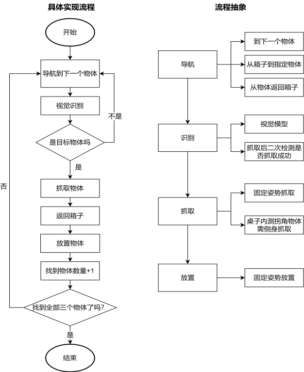
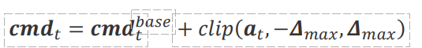
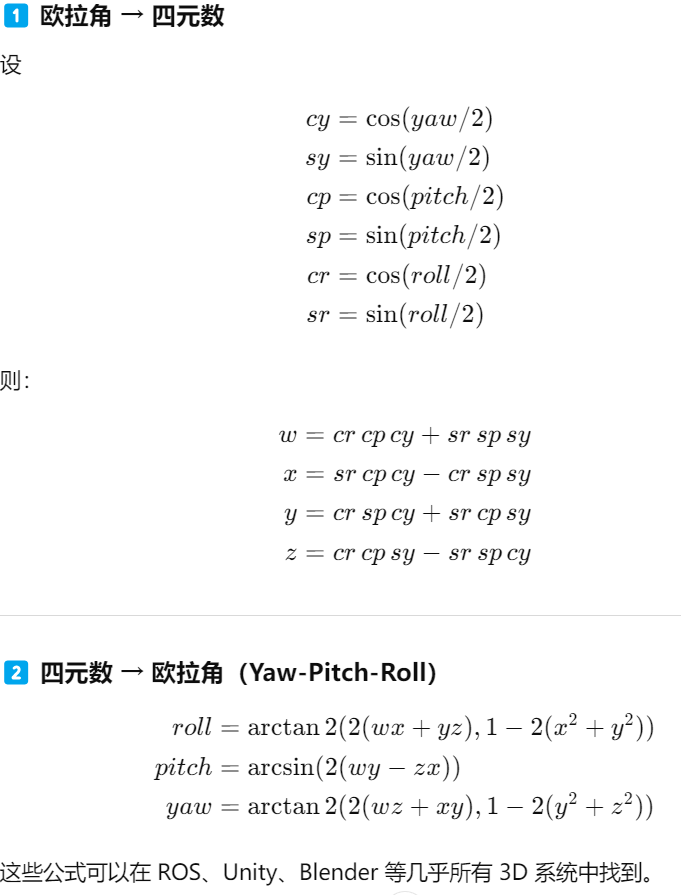

# 人形机器人具身智能的长时序任务规划
当前人形机器人虽在单一任务（如搬运、避障）中表现优异，但长时序任务规划能力不足（如连续执行多阶段任务、动态环境自适应）仍是产业化落地的核心
瓶颈。

# 设计方案
其一，构建了多模态
协同感知体系，融合深度视觉、本体状态及环境交互数据，采用 Grounded-SAM 模型
实现开放词汇目标检测与像素级分割；其二，设计了快慢思考结合的高层规划策略，将
复杂任务拆解为可复用的功能模块和原语操作链，利用基于有限状态机的规划器和基于
大语言模型的规划器实现任务规划；其三，实现了高鲁棒的底层控制能力，在调用底层
运动控制模块之前，由基于强化学习的偏差修正器输出修正后的底层控制指令。

## 机器人具身智能规划领域常用的技术方法
### 机器人控制
**模型预测控制MPC**

MPC 作为一种基于动态模型和滚动时域优化的控制策略，其核心在于通过预测未
来有限时间窗口内的状态轨迹，选择最优控制输入并执行第一步，随后根据反馈更新状
态并重复优化过程。

**全身控制WBC**

WBC 则担任"关节协调员"的角色，通过优化全身运动和力分布，协调各关节以实
现多任务优先级管理。

MPC 生成全局步态序列和短期控制指
令作为输入，WBC 则将这些指令转化为高频关节力矩执行具体动作

### 机器人多模态感知

RGB 摄像头、深度相机及激光雷达
麦克风阵列捕捉语音指令与环境声音
压力传感器、柔性电子皮肤及六维力/力矩传感器感知接触力与物体属性
IMU(惯性测量单元测6个速度分量)、编码器及关节扭矩传感器

多模态数据的融合通过早期融合（传感器层对齐）、中期融合（特征层关联）与晚期
融合（决策层协同）实现
贝叶斯网络关联，确保动作序列的精准执行

### 机器人导航
定位、路径规划、避障及多模态融合

定位技术以同步定位与地图构建（Simultaneous Localization and Mapping, 
SLAM）为核心，结合激光雷达、视觉传感器及 IMU 数据，构建厘米级精度的环境地图
激光 SLAM 视觉 SLAM 

路径规划分为全局与局部两个层次，全局规划采用 A* （A-Star）、RRT （RapidlyexploringRandom Trees）等算法在栅格地图或拓扑地图中搜索最短路径；局部规划则通过动态窗口法（Dynamic Window Approach, DWA）、时间弹性带（Timed Elastic Band, TEB）等算法实时调整轨迹，结合激光雷达或视觉检测的动态障碍物信息，确保对突发障碍物的快速响应
[RRT:  原始的RRT算法中将搜索的起点位置作为根节点，然后通过随机采样增加叶子节点的方式，生成一个随机扩展树，当随机树的叶子节点进入目标区域，就得到了从起点位置到目标位置的路径。
TEB:  TEB 算法的核心思想是将机器人的运动轨迹表示为一个弹性带（Elastic Band），并在弹性带上引入时间信息（Timed），通过优化算法调整弹性带的形状和时间分配，使其满足动力学约束和环境约束。 ]

避障策略根据障碍物类型（静态/动态、可穿越/不可穿越）动态调整
对静止货架采用绕行策略，对移动人员采用等待策略，对低矮障碍物（如
电缆）采用调整高度策略

多模态导航进一步扩展环境适应性
GPS/RTK

### 强化学习

深度强化学习

## 可用资源
全局位姿与运动状态（body_state）：包含机器人在世界坐标系的三维位置、四
元数姿态、线速度和角速度
关节状态（joint_state）：包含手部关节、腿部关节和头部关节。
传感器数据（camera 和 imu_data）：包含摄像头数据和惯性传感器数据。摄
像头信息是视觉识别的基础，包括 RGB 信息，深度图信息和相机的坐标以及朝
向。
任务上下文信息（extras）：包含当前任务阶段、任务用时、当前得分和系统退
出原因。

## 方案设计
多模态信息感知融合能力、快慢思考结合的高层规划能力以及高鲁棒的底层控制能力

**多模态信息感知融合**

Observation
本体状态摘要数据与视觉几何摘要信息一起作为当前机器人本身和环境的状态描述，输入高层规划层。 

**快慢思考结合的高层规划**

本系统分别设计了基于有限状态机的规划器和基于大语言模型（Large Language Models, LLMs）的规划器。前者为快思考规划子系统，后者为慢思考规划子系统

**高鲁棒的底层控制**

为了提高底层控制的精确性和鲁棒性，我们提出了基于强化学习的偏差修正器，在调用底层运动控制模块之前，由基于强化学习的偏差修正器4输出修正后的底层控制指令，期望减少最后的控制结果误差。

## 控制器设计
控制器从obs中获取当前任务的id，根据任务id选择不同的任务规划器生成action

/cmd_vel：控制机器人的行进速度、转向角速度。在该话题下发布消息，机器人会
根据输入的 xy 方向的线速度，以及 z 方向角速度，保持行进，直到发送停止命令。 
/cmd_pos：控制机器人的行进距离、转向角度。在该话题下发布消息，机器人会
以恒定的速度，在 xy 方向上行进指定的距离，在 z 方向上旋转指定的角度。 
/humanoid_mpc_foot_pose_target_trajectories：控制机器人单步行进。
/is_stance：机器人是否处于静止直立状态。

为每个新任务重新训练模型，只需通过文本指令（如“红色的 A 零件”）即可精准定位
目标物体，极大提升了系统的泛化性与适应性。
## 原语设计
单步行动 直线行走 定向平移 定速移动
拾起物品 放下物品 抱起/放下箱子
零件识别 直立状态判断

流程图

stage0：等待各节点启动完成
stage1：原地转向并检测台阶 
stage2：走向台阶并调整方位 

将一次性爬四级楼梯的动作拆分成了四次单级爬楼梯的动作。机器人会在双足都站稳后，才继续进行爬下一级楼梯的动作。

借助深度信息构建点云，判断机器人所处的路面情况，辅助完成定向巡航。
下蹲姿态向前直行 

减速导航模块 
包含 stage6~stage7 两个阶段，在通过崎岖路面时，选择相对平坦的路线，最终进
入指定区域。
这一阶段的控制策略与 stage2 相似，只是视觉模型的目标变为减速带。控制器根
据减速带掩码的图像坐标信息进行判断。如果减速带向左倾斜，则机器人向左旋转；如
果减速带向右倾斜，则机器人向右旋转。这一阶段的行走需要放慢速度，否则机器人容
易摔倒。此外，经过测试发现，机器人靠左行走会更稳定，因为左侧的路面更加平坦。
机器人行走过程中，视觉模型每经过固定次数的控制器循环，对减速带进行一次检测，
若连续多次检测没有发现减速带，则认为机器人已经通过了减速带，控制器进入下一个
阶段

task2

导航主要包含了三个部分，分别是零件到下一个零件的导航，箱子到零件的导航，零件到箱子的导航。识别使用任务一使用的视觉模型判断该零件是否为目标零件，同时在执行抓取后进行二次检测，判断零件是否被成功抓走。抓取采用固定手部动作进行抓取，其中八个位置的零件可正常抓取，在工作台内侧拐角的零件由于有工作台阻挡，需要特殊处理。

**我们使用设定好的固定坐标进行机器人导航，包括箱子附近的放置零件点位、所有零件的观察点位和抓取点位、以及避免和工作台各个拐角进行碰撞的机器人转弯点位，与工作台的拐角一一对应，**

提高抓取精度，机器人的左右手会执行相同的动作。抓取完成后，机器人会退回到观察点位

计算机器人当前位置与抓取点位的精确位置的差值，根据差值调整抓取动作中机器人手臂的关节旋转角度

等待一定次数的空循环（避免速度过快导致零件被扔出）

task3

## 增强学习

本模块通过在既有视觉检测与高层规划之上并行引入残差强化学习（Residual RL）控制器，提升机器人在“上楼梯”、“抓取”两类任务阶段对起始位置偏差与感知误差的鲁棒性

上楼梯子任务：当高层检测到台阶并由任务管理器进入“上楼梯”阶段时，残差控制器被激活；残差用于微调步端目标位置与局部步态参数，以保证台阶对齐、重心适配与防滑。 
抓取子任务：当高层定位抓取点并进入“抓取”阶段时，残差控制器被激活；残差用于末端位姿的微调与抓取触发决策，以提升夹取与放置成功率。

视觉几何摘要
（1）机器人到该平面中心的距离标量；（2）从机器人指向该中心的单位方向向量；（3）楼梯垂直面的单位法向量

抓取任务：目标物体的视觉几何摘要为（1）机器人到该物体中心的距离标量；（2）目标质心相对于机器人基座的三维相对位置单位向量。 

本体状态摘要
上楼梯任务的本体状态摘要包含：基座的线速度与角速度、腿部关节的角度与角速度、以及惯性测量单元的线加速度与角速度。
抓取任务的本体状态摘要包含：手臂各关节的角度与角速度、末端执行器相对于基座的位置表示。

### 动作定义与下发机制
残差在应用前先完成坐标对齐（转�换到机器人自体坐标系）、限幅与滤波处理，然后与基线命令按元素级合并并下发执行。

delta(max) 为各通道的硬上限（位置增量上限 0.05 m，角度/姿态增量上限 0.05 rad

高层规划器输出的目标位置和 actor输出的残差合并后的pt(foot)通过中间合并节点下发至humanoid_mpc_foot_pose_target_trajectories，由原有步态模块执行。残差仅在“上楼梯”阶段启用。 

末端命令通过中间合并节点映射为手臂关节目标或上层抓取动作序列并发布到相应控制话题。 

运行时中间合并与安全保障机制： 
1. 中间合并节点：实现残差与基线命令的坐标对齐、限幅、滤波与合并逻辑，作为唯一向外发布控制命令的节点，从而将学习器输出与现有控制栈解耦。 
2. 残差开关与条件发布：残差仅在任务阶段触发信号有效且基线命令允许的情况下发布；任何时刻均可通过开关将残差禁止以回退到纯启发式控制。
3. 幅度与速率限制：对残差实行硬限幅（位置 0.05 m、角度 0.05 rad）和速率限制（基于一阶滤波器系数），保证对主控制器的非破坏性微调。 
4. 安全回退：当中间合并节点检测到异常（超阈振荡、发布失败或跌倒指示），立即停止残差通道并回退至基线命令，同时触发紧急停止/恢复逻辑。

### 奖励设计:

**上楼梯任务奖励**
dt(foot) = ||pt(foot) - p(target)||

稠密:
rt(progess) = a1*(dt-1(foot) - dt(foot))
该项奖励鼓励机器人在每一步都尽可能接近目标足位，从而提升动作连贯性。 

稀疏:
r(success) = {+R,dt(foot) < 阈值 且无跌倒;-R,dt(foot) >= 阈值 或有跌倒}
该项直接衡量落脚是否达到高层规划的目标位置，从而补偿“抬脚→落脚”周期内仅靠进度项无法完整表达的落点质量。 

对稠密项设上下限以防异常数值；对终态项的量级应显著高于单步稠密项累计期望，以保证策略不会被稠密奖励“欺骗”而忽视落脚质量或安全。

**抓取任务奖励**
dt(ee) = ||pt(ee) - p(object)||

稠密:
rt(progess) = a2*(dt-1(ee) - dt(ee))

稀疏:
r(success) = {+R,成功抓取;-R,未抓取}

抓取成功/失败判定优先使用环境直接返回的标志；若不可用，允许使用二次视觉判定或夹持器接触/力检测作为替代判定源，判定逻辑须在训练前明确并与奖励接口对齐。 

为避免策略产生“靠近但不抓取”的行为，稀疏奖励量级应由训练初期的统计实验调整到能显著驱动策略去完成抓取动作。 

**课程学习**
本方案引入基于初始位置偏差的课程学习机制。课程通过调整训练 episode 的初始位姿（位置与朝向偏差）来调节难度。

课程按难度分为三档（Level 0、Level 1、Level 2），分别对应从易到难的初始偏差范围，按任务区分如下。 
机器人基座相对于规划起点的初始偏差
末端与物体预位的初始相对偏差

为避免灾难性遗忘，训练始终保留约 20%的并行 worker 采样较低难度情形，其余 worker 按当前课程分布采样。 

但仍有以下方向可进一步探索：（1）动态环境自适应强化，结合强化学习模块，在其它模块中引入残差控制策略，通过少量样本学习修正基线动作的偏差，提升对起始位置误差与感知噪声的鲁棒性；（2）多模态融合的语义导航，当前方案依赖预定义点位，未来可结合 SLAM技术构建环境语义地图，实现 L形桌面的实时建模与动态路径规划；（3）复杂场景的泛化能力测试，在扩展场景中验证方案可行性。 
加入语音控制，多模态识别目标，神经网络辅助抓取
---------------------------
ppo:Proximal Policy Optimization
每次策略更新，都必须保证新策略与旧策略之间的差异在一个“信赖域”之内。这个差异通常用KL散度（Kullback-Leibler Divergence）来衡量，它量化了两个概率分布之间的距离。

策略比率（Probability Ratio）：衡量“新旧”策略的差异

PPO最核心的创新点就在于这个“剪裁”机制。它修改了传统的策略梯度目标函数，引入了一个剪裁项，确保策略比率
不会超出某个预设的范围 

点云:
常见的摄影测量就是将二维影像通过一系列计算可以获取高精度的三维模型，在这一过程中我们同样可以获取点云数据
点云是某个坐标系下的点的数据集。

点包含了丰富的信息，包括三维坐标X，Y，Z、颜色、分类值、强度值、时间等等，不一一列举。

高精度三维点云数据通过算法拟合生成曲面，用于三维建模，精度高，细节更精细，同时，建模速度快。

----------------------------

# 详细设计
automask grounded sam.GroundedSAM2

grounding dino:包含检测到的物体边界框和标签等信息
SAM2: Segment Anything in Images and Videos

GroundedSAM2 —— 视觉感知模块

功能：结合 Grounding DINO + SAM2 实现图像分割与物体检测。
作用：输入图像与文字提示，输出检测到的物体掩码与边界框，可生成注释图像。

StairClimbingPlanner —— 楼梯步态规划模块
功能：生成机器人上楼梯的步态轨迹。
参数：步态周期 dt、步宽、台阶高度、长度等。
输出：
时间轨迹 time_traj
脚步索引 foot_idx_traj
脚步与躯干轨迹
应用场景：仿真或真实环境中的楼梯攀爬任务。

TaskSolver —— 主控制与任务规划模块

ROS 通信接口（订阅/发布/服务）
感知（Grounded-SAM2）、动作规划（步态+机械臂）、控制执行
多阶段任务状态机（stage0 ~ stage10）

主要任务流程：
任务一（楼梯任务）：阶段0–8
stage1_solver()：检测楼梯
stage2_solver()：对准楼梯
stage3_solver()：上楼梯
stage4-5_solver()：检测是否上楼/平台
stage6-8_solver()：调整姿态并通过绿色区域
任务二（物体抓取与搬运）：阶段9
搜索目标 → 靠近并抓取 → 回收纳箱 → 放置物体。
任务三（箱体搬运）：阶段10
机械臂准备 → 导航到箱体 → 抓取 → 搬运 → 放置。

detect_object()：视觉检测。
do_action(cmd, number)：基础动作控制。
move_to_point() / go_to_point()：导航。
pick_object() / place_object()：物体操作。
search_following_object()：完整搜索-抓取-放置循环。
TaskOne_solver() / TaskTwo_solver()：任务总调度。

----------------------------------

----------------------------------
# 代码部分
StairClimbingPlanner.py

tasksovler初始化 -> startlaunch(roslaunch 文件启动一堆节点) -> init_ros

主动调用controller/solver的 get_action/next_action -> process_obs -> obs_to_action -> 循环并以action形式发布数据

get_foot_pose_traj_msg,generate_steps,get_multiple_steps_msg
生成多步步态消息

joint_command_callback:根据joint_cmd中的数据

## 自写逻辑
process_obs -> obs_to_action -> task1/2

do_action
左右转 前后左右走
move
调用步态接口
walk
调用行走接口
action_is_finished
当前动作是否完成(state 0 且 stance false->state 1  ||| state 1 且 stance true -> 等待10s变state2)

### task1  stage 0-8

0 初始化 1对准楼梯方向

#counter1用来计数连续检测到楼梯的次数/当前阶段进度
#counter2用来避免do_action()重发发布消息
#counter3用来等待机器人站稳
self.action_state=0  #0表示未开始，1表示进行中，2表示已完成

2 导航到楼梯前
**from .depth_process import process_depth** ??
对每个 x 取 y 最大的点，构成“楼梯下沿轮廓”
左边缘 = 最小 x；
右边缘 = 最大 x；

3 上楼梯
#counter0用来计数上楼梯的步骤

**go_to_point** ?
**move_to_point** ?   走到楼梯跟前

姿态微调
调用上楼规划器

**不断调节self.torso_traj**

4 检测是否完全上楼并调整姿态

当 pitch 接近水平（>-0.8 rad），说明脚下地面已经平了
通过扫描 mask 特定行（y=150 和 y=250）的左右边缘点来计算地面倾斜与偏心

计算左右拍摄图像斜率(?不应该近大远小吗)

5 检测机器人是否完全通过楼梯并在平台上调整姿态

与前一阶段类似
同样用 RANSAC 拟合地面，但判断法向量是否接近水平（pitch<-0.9）

7 第七阶段求解器，平台末端精细对齐与前进
#counter0用来计数,减少重复调用
如果检测框几乎覆盖整个画面高度（y1<5 且 y2>250），说明条纹很近、已经到达平台边缘；
连续检测 3 次以防误判；
然后进入下一阶段（stage=8）

没有检测到就小步前进
**如果平台变很长怎么办**?

8 检测绿色区域并完成最终前进与转向
构成一个条纹下沿的轮廓线,记录最低点

### 辅助函数 
静态写死的坐标
当前的朝向需要主动传入

go_to_point  距离很小直接取消 角度差距很小直接走一半距离s
move_to_point  若仍有轻微偏差，设定 x/y/delta 的最小微调速度（0.1）。
如果有任何方向仍偏差较大：执行一次 move() 并返回 0（表示仍在移动）。
若全部偏差在 0.05 内：保存当前残差并返回 1（表示到达完成）。

obj9由于位置需要特殊处理

#counter4 用来表示#arm angle / 当前等待进度
pick_object
每一步均等待若干次循环
0:初始准备（腕部内外旋）   将双臂从收拢姿态摆到抓取准备位。
1:抬臂靠近目标物体
1.5:微调（姿态校正）
2:张开手指（准备抓取）
3:执行抓取动作
4:握紧确认
5:抬起手臂（提物）
6:复位（动作完成） 【?

place_object
0:
1:
2:
2.5:
3:
4:
4.5:
5:
6:
类似逻辑，机械般一步步放置

detect_object
判断当前物品的类型

move_to_target_object
特别生硬写死角度

move_closer_and_pick
同上对应写死

go_to_observe
到观察点拍照

start_search
go_to_observe -> search_following_object
        1. 如果还未找到任何目标物体，调用 search_following_object() 开始搜索。
        2. 如果已找到部分目标物体且未完成全部任务，分为两种情况：
            - 若当前在箱子处，调用 from_container_to_object() 导航到下一个目标物体，并判断是否为目标物体。
            - 若不在箱子处，调用 search_following_object() 继续搜索和抓取流程。
        3. 如果已完成全部目标物体的抓取与搬运，则切换到 stage=10，进入任务结束或下一个流程。

search_following_object
to_next_object -> move_to_target_object -> detect_object-> to_next_object/move_closer_and_pick -> back_to container -> palce_object -> move_to_point 

to_next_object
写死行列，角度和关键经过点

from_container_to_object
类似于to_next_object

back_to_container
相同的写死逻辑

TaskTwo_solver
stage9_solver stage10_solver

stage9_solver
初始化调整姿态之后进入 start_search

grab_container/place_container
逻辑类似,写死动作

stage10_solver
move_to_point[container] -> move_to_point[containergrab]

### 其他文件中的内容

-----
优化的地方
先试试第二阶段导航建图？

now：当在做一个动作的时候调用action_is_finished()确保完成之后再进行下一个动作
stage1 只能turnleft?
stage2 写死? 顺序执行?
get_pos所有都写死？
stage8 移动数据写死?

detect_object没有使用VLM
move_to_target_object
特别生硬写死角度
没有检测是否真的抓取到了物体

厂商遥控器控制机器人的具体逻辑

导航使用关键点行走模式
是否可以扫描建图然后标记物品坐标和形状->接到目标之后直接调用VLM然后根据目标位置自行规划路线(ROS导航系统)

残差强化学习在哪里?

---
democontroller 93 line

多模态大模型优化
蒸馏 微调（小模型通过模仿大模型的输出学到知识，而不直接看原始数据 再训练一段时间）
用 GPT-4 生成回答数据，训练一个 7B 参数的模型 → 得到 MiniGPT-4

COT Grounding
chain of thought 边想边说 
grounding 基于外部知识(rag，多模态)

KL散度
衡量一个概率分布P和另一个分布Q有多不一样
训练一个模型等价于最小化 KL 散度

多模态实现
CLIP 是一种把「图像」和「文字」训练到同一个语义空间的模型

第一关rl
第二关多模态
变智能

------------------------------------------------------
扫描建图,
结合VLM辅助建图，
建图后使用VLM配合进行环绕规划，

检测到东西后使用VLM进行抓取规划？

----------------------------
我添加的：
新建线程发布器，发布ros节点信息，以便在其他软件包中运行对应逻辑

先分开、后集成完全没问题；
ROS 的通信层是运行时解耦的，工作空间只是构建和组织问题；
只要环境正确 source，就能随意跨 workspace 协作