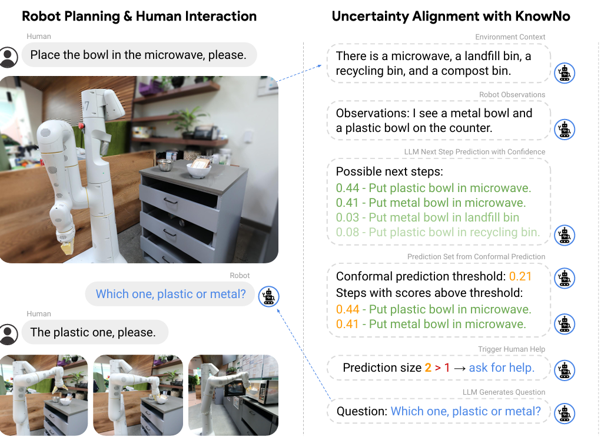

# Robots That Ask For Help: Uncertainty Alignmentfor Large Language Model Planners

## 思路

当前 LLM LLM 的主要挑战之一是其倾向于幻想，即自信地生成看似合理但实际上是错误且与现实脱节的输出。这种对不正确输出的错误信心给基于 LLM LLM 的机器人规划带来了重大挑战。此外，在现实世界环境中，自然语言指令通常包含固有或人为的高程度模糊性，盲目遵循一个错误构建的计划可能会导致不希望的甚至危险的动作。

 the robot should know when it doesn’t know and ask for clarification
 instead (e.g., ask which bowl should be placed in the microwave)

calibrated confidence   minimal help
uncertainty alignment

(1) 校准信心：机器人应该寻求足够的帮助以确保用户指定的统计上保证的任务成功水平。
(2) 最小化帮助：机器人应该通过缩小任务中可能存在的歧义来最小化它所寻求的帮助总量。

论文的主要贡献：文章提出了(KnowNo)，这是一个基于共型预测理论（conformal Prediction ，CP ）的框架，用于对基于语言模型的规划器的不确定性进行建模

减少必要的求助
在多种环境和实现方式下的实验验证了 KNOWNO 能够在提供任务成功率的统计保证的同时，相较于基准方法减少 10%至 24%的帮助需求。

## 做法和逻辑
多选题生成：大语言模型（LLM）生成一组带标签的多样化候选计划（选项'A'、'B'、'C'、'D'），并事后追加一个额外选项'E）未列出选项'。我们将这组标签记为Y:={‘A’,‘B’,‘C’,‘D’,‘E’}。这些计划通过向LLM输入上下文xt生成，该上下文包含：(1)机器人每步观测（如使用基于视觉的目标检测器或参考真值，见图1），(2)用户指令，以及(3)其他场景可能计划的少量示例。通过将LLM生成的计划追加到上下文xt，得到增强语境˜xt。

预测集生成：利用共形预测（CP）从候选计划Y中选择子集C(˜xt)⊆Y，依据LLM对每个预测y∈Y在语境˜xt下的（未校准）置信度ˆ f(˜xt)y。

人工协助：若预测集非单例，机器人则借助人类（或任何监督智能体，记作函数fH）协助确定明确下一步yH∈C(˜xt)。

底层控制：底层模块φ将yH中的计划转换为动作at=φ(yH)。

符合性预测的作用，它能让你不仅仅看到模型的预测结果，还能知道该结果的可靠性
假设你只是看到了模型的输出：“预测结果：会得病”。但你不知道这个预测的可信度如何，万一模型出错了呢？如果你只看到了一个肯定的答案，那么没有任何保障。而如果你使用符合性预测，你可以知道预测结果是有多高的可信度，从而更有信心地做决策。

对于校准数据集中的每个样本，计算一个非符合性分数（nonconformity score）。

非符合性分数衡量的是预测结果与实际结果的差异。例如，在回归任务中，非符合性分数可以是预测值与真实值的差的绝对值；在分类任务中，非符合性分数可能是模型预测的概率与真实类别之间的差异。

可选择性和评估

总的来说，KNOWNO 在所有实验中都表现出较高的任务成功率和较低的人类干预率。特别是在模糊指令较多的情况下，KNOWNO能够显著减少人类干预次数。此外，KNOWNO的目标成功率保证机制使其不受特定LLM的影响，因此可以在不同的LLM 上实现一致的结果。