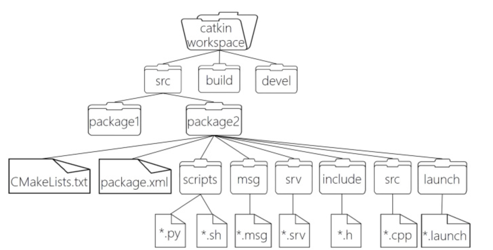
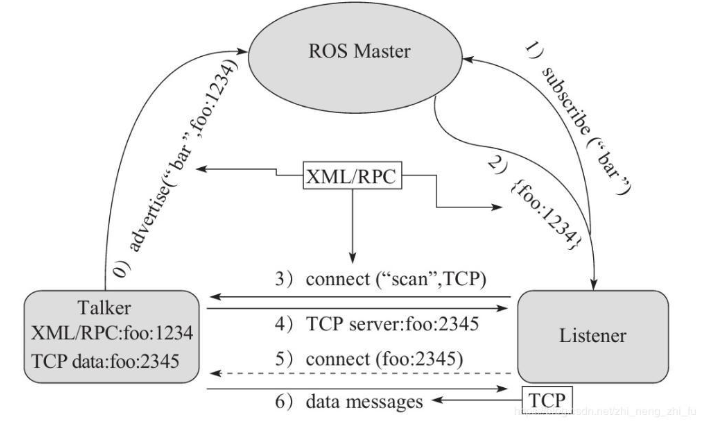
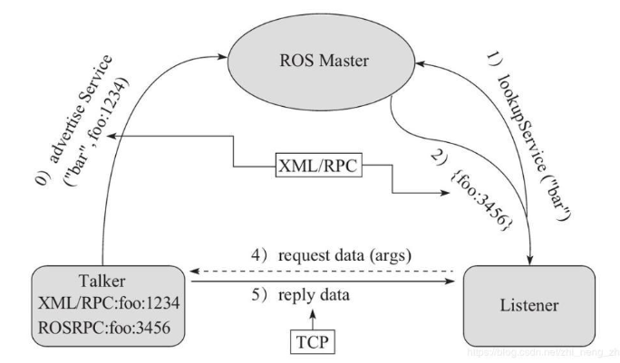

ROS设计者将ROS表述为“ROS = Plumbing + Tools + Capabilities + Ecosystem”

Plumbing: 通讯机制(实现ROS不同节点之间的交互)

Tools :工具软件包(ROS中的开发和调试工具)

Capabilities :机器人高层技能(ROS中某些功能的集合，比如:导航)

Ecosystem:机器人生态系统(跨地域、跨软件与硬件的ROS联盟)

立足维护者的角度: ROS 架构可划分为两大部分

main：核心部分，主要由Willow Garage 和一些开发者设计、提供以及维护。它提供了一些分布式计算的基本工具，以及整个ROS的核心部分的程序编写。

universe：全球范围的代码，有不同国家的ROS社区组织开发和维护。一种是库的代码，如OpenCV、PCL等；库的上一层是从功能角度提供的代码，如人脸识别，他们调用下层的库；最上层的代码是应用级的代码，让机器人完成某一确定的功能。

OS 层，也即经典意义的操作系统

ROS 只是元操作系统，需要依托真正意义的操作系统，目前兼容性最好的是 Linux 的 Ubuntu，Mac、Windows 也支持 ROS 的较新版本

中间层

是 ROS 封装的关于机器人开发的中间件，比如:

基于 TCP/UDP 继续封装的 TCPROS/UDPROS 通信系统

用于进程间通信 Nodelet，为数据的实时性传输提供支持

另外，还提供了大量的机器人开发实现库，如：数据类型定义、坐标变换、运动控制....

应用层

功能包，以及功能包内的节点，比如: master、turtlesim的控制与运动节点...

4.自身结构
就 ROS 自身实现而言: 也可以划分为三层

文件系统

ROS文件系统级指的是在硬盘上面查看的ROS源代码的组织形式

计算图

ROS 分布式系统中不同进程需要进行数据交互，计算图可以以点对点的网络形式表现数据交互过程，计算图中的重要概念: 节点(Node)、消息(message)、通信机制_主题(topic)、通信机制_服务(service)

开源社区

ROS的社区级概念是ROS网络上进行代码发布的一种表现形式

发行版（Distribution）　ROS发行版是可以独立安装、带有版本号的一系列综合功能包。ROS发行版像Linux发行版一样发挥类似的作用。这使得ROS软件安装更加容易，而且能够通过一个软件集合维持一致的版本。

软件库（Repository）　ROS依赖于共享开源代码与软件库的网站或主机服务，在这里不同的机构能够发布和分享各自的机器人软件与程序。

ROS维基（ROS Wiki）　ROS Wiki是用于记录有关ROS系统信息的主要论坛。任何人都可以注册账户、贡献自己的文件、提供更正或更新、编写教程以及其他行为。网址是http://wiki.ros.org/。

Bug提交系统（Bug Ticket System）如果你发现问题或者想提出一个新功能，ROS提供这个资源去做这些。

邮件列表（Mailing list）　ROS用户邮件列表是关于ROS的主要交流渠道，能够像论坛一样交流从ROS软件更新到ROS软件使用中的各种疑问或信息。网址是http://lists.ros.org/。

ROS问答（ROS Answer）用户可以使用这个资源去提问题。网址是https://answers.ros.org/questions/。

博客（Blog）你可以看到定期更新、照片和新闻。网址是https://www.ros.org/news/，不过博客系统已经退休，ROS社区取而代之，网址是https://discourse.ros.org/。

1.5.1 ros文件系统

1.5.2 ROS文件系统相关命令
1.增
catkin_create_pkg 自定义包名 依赖包 === 创建新的ROS功能包

sudo apt install xxx === 安装 ROS功能包

2.删
sudo apt purge xxx ==== 删除某个功能包

3.查
rospack list === 列出所有功能包

rospack find 包名 === 查找某个功能包是否存在，如果存在返回安装路径

roscd 包名 === 进入某个功能包

rosls 包名 === 列出某个包下的文件

apt search xxx === 搜索某个功能包

4.改
rosed 包名 文件名 === 修改功能包文件

需要安装 vim

比如:rosed turtlesim Color.msg

5.执行
5.1roscore
roscore === 是 ROS 的系统先决条件节点和程序的集合， 必须运行 roscore 才能使 ROS 节点进行通信。

roscore 将启动:

ros master

ros 参数服务器

rosout 日志节点

用法:

roscore
或(指定端口号)

roscore -p xxxx

5.2rosrun
rosrun 包名 可执行文件名 === 运行指定的ROS节点

比如:rosrun turtlesim turtlesim_node

5.3roslaunch
roslaunch 包名 launch文件名 === 执行某个包下的 launch 文件

1.5.3 ros计算图

1.计算图简介
前面介绍的是ROS文件结构，是磁盘上 ROS 程序的存储结构，是静态的，而 ros 程序运行之后，不同的节点之间是错综复杂的，ROS 中提供了一个实用的工具:rqt_graph。

rqt_graph能够创建一个显示当前系统运行情况的动态图形。ROS 分布式系统中不同进程需要进行数据交互，计算图可以以点对点的网络形式表现数据交互过程。rqt_graph是rqt程序包中的一部分。

rosrun rqt_graph rqt_graph

ROS 中的基本通信机制主要有如下三种实现策略:

话题通信(发布订阅模式)

服务通信(请求响应模式)

参数服务器(参数共享模式)

**话题通信**

话题通信是ROS中使用频率最高的一种通信模式，话题通信是基于发布订阅模式的，也即:一个节点发布消息，另一个节点订阅该消息。话题通信的应用场景也极其广泛

像雷达、摄像头、GPS.... 等等一些传感器数据的采集，也都是使用了话题通信，换言之，话题通信适用于不断更新的数据传输相关的应用场景。
用于不断更新的、少逻辑处理的数据传输场景

理论模型:
ROS Master (管理者)
Talker (发布者)
Listener (订阅者)

ROS Master 负责保管 Talker 和 Listener 注册的信息，并匹配话题相同的 Talker 与 Listener，帮助 Talker 与 Listener 建立连接，连接建立后，Talker 可以发布消息，且发布的消息会被 Listener 订阅。

步骤:

0.Talker注册
Talker启动后，会通过RPC在 ROS Master 中注册自身信息，其中包含所发布消息的话题名称。ROS Master 会将节点的注册信息加入到注册表中。

1.Listener注册
Listener启动后，也会通过RPC在 ROS Master 中注册自身信息，包含需要订阅消息的话题名。ROS Master 会将节点的注册信息加入到注册表中。

2.ROS Master实现信息匹配
ROS Master 会根据注册表中的信息匹配Talker 和 Listener，并通过 RPC 向 Listener 发送 Talker 的 RPC 地址信息。

3.Listener向Talker发送请求
Listener 根据接收到的 RPC 地址，通过 RPC 向 Talker 发送连接请求，传输订阅的话题名称、消息类型以及通信协议(TCP/UDP)。

4.Talker确认请求
Talker 接收到 Listener 的请求后，也是通过 RPC 向 Listener 确认连接信息，并发送自身的 TCP 地址信息。

5.Listener与Talker建立连接
Listener 根据步骤4 返回的消息使用 TCP 与 Talker 建立网络连接。

T6.alker向Listener发送消息
连接建立后，Talker 开始向 Listener 发布消息。

注意1:上述实现流程中，前五步使用的 RPC协议，最后两步使用的是 TCP 协议

注意2: Talker 与 Listener 的启动无先后顺序要求

注意3: Talker 与 Listener 都可以有多个

注意4: Talker 与 Listener 连接建立后，不再需要 ROS Master。也即，即便关闭ROS Master，Talker 与 Listern 照常通信。

话题通信自定义msg
msgs只是简单的文本文件，每行具有字段类型和字段名称，可以使用的字段类型有：

int8, int16, int32, int64 (或者无符号类型: uint*)

float32, float64

string

time, duration

other msg files

variable-length array[] and fixed-length array[C]

流程:

按照固定格式创建 msg 文件
编辑配置文件
编译生成可以被 Python 或 C++ 调用的中间文件

**服务通信**

服务通信也是ROS中一种极其常用的通信模式，服务通信是基于请求响应模式的，是一种应答机制。也即: 一个节点A向另一个节点B发送请求，B接收处理请求并产生响应结果返回给A。比如如下场景:

机器人巡逻过程中，控制系统分析传感器数据发现可疑物体或人... 此时需要拍摄照片并留存。

在上述场景中，就使用到了服务通信。

一个节点需要向相机节点发送拍照请求，相机节点处理请求，并返回处理结果
与上述应用类似的，服务通信更适用于对时时性有要求、具有一定逻辑处理的应用场景。

用于偶然的、对时时性有要求、有一定逻辑处理需求的数据传输场景。

理论模型:
ROS master(管理者)
Server(服务端)
Client(客户端)

0.Server注册
Server 启动后，会通过RPC在 ROS Master 中注册自身信息，其中包含提供的服务的名称。ROS Master 会将节点的注册信息加入到注册表中。

1.Client注册
Client 启动后，也会通过RPC在 ROS Master 中注册自身信息，包含需要请求的服务的名称。ROS Master 会将节点的注册信息加入到注册表中。

2.ROS Master实现信息匹配
ROS Master 会根据注册表中的信息匹配Server和 Client，并通过 RPC 向 Client 发送 Server 的 TCP 地址信息。

3.Client发送请求
Client 根据步骤2 响应的信息，使用 TCP 与 Server 建立网络连接，并发送请求数据。

4.Server发送响应
Server 接收、解析请求的数据，并产生响应结果返回给 Client。

服务通信自定义srv

**参数服务器**
全局路径规划和本地路径规划时，就会使用到参数服务器：

路径规划时，需要参考小车的尺寸，我们可以将这些尺寸信息存储到参数服务器，全局路径规划节点与本地路径规划节点都可以从参数服务器中调用这些参数
参数服务器，一般适用于存在数据共享的一些应用场景。

理论模型

参数服务器实现是最为简单的，该模型如下图所示,该模型中涉及到三个角色:

ROS Master (管理者)
Talker (参数设置者)
Listener (参数调用者)

1.Talker 设置参数
Talker 通过 RPC 向参数服务器发送参数(包括参数名与参数值)，ROS Master 将参数保存到参数列表中。

2.Listener 获取参数
Listener 通过 RPC 向参数服务器发送参数查找请求，请求中包含要查找的参数名。

3.ROS Master 向 Listener 发送参数值
ROS Master 根据步骤2请求提供的参数名查找参数值，并将查询结果通过 RPC 发送给 Listener。

ros::NodeHandle

ros::param

2.4 常用命令

rosnode : 操作节点
rostopic : 操作话题
rosservice : 操作服务
rosmsg : 操作msg消息
rossrv : 操作srv消息
rosparam : 操作参数

作用
和之前介绍的文件系统操作命令比较，文件操作命令是静态的，操作的是磁盘上的文件，而上述命令是动态的，在ROS程序启动后，可以动态的获取运行中的节点或参数的相关信息。

**rosnode**
rosnode ping    测试到节点的连接状态
rosnode list    列出活动节点
rosnode info    打印节点信息
rosnode machine    列出指定设备上节点
rosnode kill    杀死某个节点
rosnode cleanup    清除不可连接的节点
清除无用节点，启动乌龟节点，然后 ctrl + c 关闭，该节点并没被彻底清除，可以使用 cleanup 清除节点

**rostopic**
rostopic bw     显示主题使用的带宽
rostopic delay  显示带有 header 的主题延迟
rostopic echo   打印消息到屏幕
rostopic find   根据类型查找主题
rostopic hz     显示主题的发布频率
rostopic info   显示主题相关信息
rostopic list   显示所有活动状态下的主题
rostopic pub    将数据发布到主题
rostopic type   打印主题类型

**rosmsg**
rosmsg show    显示消息描述
rosmsg info    显示消息信息
rosmsg list    列出所有消息
rosmsg md5    显示 md5 加密后的消息  :http://wiki.ros.org/ROS/Technical%20Overview#Message_serialization_and_msg_MD5_sums)
rosmsg package    显示某个功能包下的所有消息
rosmsg packages    列出包含消息的功能包

//rosmsg show 消息名称
rosmsg show turtlesim/Pose
结果:
float32 x
float32 y
float32 theta
float32 linear_velocity
float32 angular_velocity

**rosservice**
rosservice args 打印服务参数
rosservice call    使用提供的参数调用服务
rosservice find    按照服务类型查找服务
rosservice info    打印有关服务的信息
rosservice list    列出所有活动的服务
rosservice type    打印服务类型
rosservice uri    打印服务的 ROSRPC uri

**rossrv**
rossrv是用于显示有关ROS服务类型的信息的命令行工具，与 rosmsg 使用语法高度雷同
rossrv show    显示服务消息详情
rossrv info    显示服务消息相关信息
rossrv list    列出所有服务信息
rossrv md5    显示 md5 加密后的服务消息
rossrv package    显示某个包下所有服务消息
rossrv packages    显示包含服务消息的所有包

**rosparam**
rosparam set    设置参数
rosparam get    获取参数
rosparam load    从外部文件加载参数
rosparam dump    将参数写出到外部文件
rosparam delete    删除参数
rosparam list    列出所有参数

实操:
首先需要了解控制节点与显示节点通信使用的话题与消息，可以使用ros命令结合计算图来获取。

rqt_graph 或 rostopic list 获取话题 yyy
通过 rostopic type yyy 获取消息类型 xxx
通过 rosmsg info xxx 获取消息格式和详情

写c++自定义节点

ros::spinOnce(); 让 ROS 处理 一次 当前所有待处理的 消息回调（如订阅话题的 callback 函数）。
while (ros::ok()) {
    // 处理一次回调（如果有新消息）
    ros::spinOnce();

    // 其他任务（如控制逻辑、计算等）
    do_other_work();

    // 控制循环频率（可选）
    loop_rate.sleep();
}

ros::NodeHandle 是几乎所有 ROS 相关操作的基础句柄，它的创建时机和用途如下：

1. 何时创建 ros::NodeHandle？
通常需要在 以下操作之前 创建：

发布/订阅话题
调用/提供服务
访问参数服务器
使用定时器
任何需要与 ROS 通信系统交互的操作
最佳实践：在 ros::init() 之后立即创建，确保 ROS 上下文已初始化。

服务调用实操: rosservice list
             rosservice type <service_name>
             rossrv info <service_type>
            编写服务客户端

参数设置实操: rosparam list
            编写参数修改客户端
    或者直接命令行 rosparam set <param_name> <value>
    或者启动时候加入参数
    rosrun turtlesim turtlesim_node _background_r:=100 _background_g=0 _background_b=0

    或者launch文件中
    <launch>
    <node pkg="turtlesim" type="turtlesim_node" name="set_bg" output="screen">
        <!-- launch 传参策略1 -->
        <!-- <param name="background_b" value="0" type="int" />
        <param name="background_g" value="0" type="int" />
        <param name="background_r" value="0" type="int" /> -->

        <!-- launch 传参策略2 -->
        <rosparam command="load" file="$(find demo03_test_parameter)/cfg/color.yaml" />
    </node>

2.6 通信机制比较
            Topic(话题)	       Service(服务)
通信模式	发布/订阅	        请求/响应
同步性	    异步	            同步
底层协议	ROSTCP/ROSUDP	    ROSTCP/ROSUDP
缓冲区	    有	                无
时时性	    弱	                强
节点关系	多对多	            一对多(一个 Server)
通信数据	msg	                srv
使用场景	连续高频的数据发     偶尔调用或执行某一项
            布与接收:           特定功能：拍照、语音识别
            雷达、里程计	

