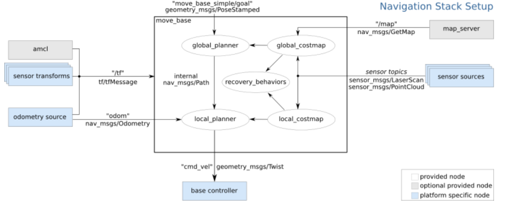

URDF 不能单独使用，需要结合 Rviz 或 Gazebo，URDF 只是一个文件，需要在 Rviz 或 Gazebo 中渲染成图形化的机器人模型

准备:新建功能包，导入依赖

核心:编写 urdf 文件

核心:在 launch 文件集成 URDF 与 Rviz

在 Rviz 中显示机器人模型萨

在 ROS 中，可以将 urdf 文件的路径设置到参数服务器，使用的参数名是:robot_description

重复启动launch文件时，Rviz 之前的组件配置信息不会自动保存，需要重复执行步骤4的操作，为了方便使用，可以使用如下方式优化:

首先，将当前配置保存进config目录然后，launch文件中 Rviz 的启动配置添加参数:args,值设置为-d 配置文件路径

## URDF

URDF 文件是一个标准的 XML 文件，在 ROS 中预定义了一系列的标签用于描述机器人模型，机器人模型可能较为复杂，但是 ROS 的 URDF 中机器人的组成却是较为简单，可以主要简化为两部分:连杆(link标签) 与 关节(joint标签)，接下来我们就通过案例了解一下 URDF 中的不同标签:

robot 根标签，类似于 launch文件中的launch标签
link 连杆标签
joint 关节标签
gazebo 集成gazebo需要使用的标签

关于gazebo标签，后期在使用 gazebo 仿真时，才需要使用到，用于配置仿真环境所需参数，比如: 机器人材料属性、gazebo插件等，但是该标签不是机器人模型必须的，只有在仿真时才需设置

**robot**
urdf 中为了保证 xml 语法的完整性，使用了robot标签作为根标签，所有的 link 和 joint 以及其他标签都必须包含在 robot 标签内,在该标签内可以通过 name 属性设置机器人模型的名称

**link**
urdf 中的 link 标签用于描述机器人某个部件(也即刚体部分)的外观和物理属性，比如: 机器人底座、轮子、激光雷达、摄像头...每一个部件都对应一个 link, 在 link 标签内，可以设计该部件的形状、尺寸、颜色、惯性矩阵、碰撞参数等一系列属性

1.属性
name ---> 为连杆命名
2.子标签
visual ---> 描述外观(对应的数据是可视的)

geometry 设置连杆的形状

标签1: box(盒状)

属性:size=长(x) 宽(y) 高(z)
标签2: cylinder(圆柱)

属性:radius=半径 length=高度
标签3: sphere(球体)

属性:radius=半径
标签4: mesh(为连杆添加皮肤)

属性: filename=资源路径(格式:package://<packagename>/<path>/文件)
origin 设置偏移量与倾斜弧度

属性1: xyz=x偏移 y便宜 z偏移

属性2: rpy=x翻滚 y俯仰 z偏航 (单位是弧度)

metrial 设置材料属性(颜色)

属性: name

标签: color

属性: rgba=红绿蓝权重值与透明度 (每个权重值以及透明度取值[0,1])
collision ---> 连杆的碰撞属性

Inertial ---> 连杆的惯性矩阵

在此，只演示visual使用。

    <link name="base_link">
        <visual>
            <!-- 形状 -->
            <geometry>
                <!-- 长方体的长宽高 -->
                <!-- <box size="0.5 0.3 0.1" /> -->
                <!-- 圆柱，半径和长度 -->
                <!-- <cylinder radius="0.5" length="0.1" /> -->
                <!-- 球体，半径-->
                <!-- <sphere radius="0.3" /> -->

            </geometry>
            <!-- xyz坐标 rpy翻滚俯仰与偏航角度(3.14=180度 1.57=90度) -->
            <origin xyz="0 0 0" rpy="0 0 0" />
            <!-- 颜色: r=red g=green b=blue a=alpha -->
            <material name="black">
                <color rgba="0.7 0.5 0 0.5" />
            </material>
        </visual>
    </link>

**joint**
urdf 中的 joint 标签用于描述机器人关节的运动学和动力学属性，还可以指定关节运动的安全极限，机器人的两个部件(分别称之为 parent link 与 child link)以"关节"的形式相连接，不同的关节有不同的运动形式: 旋转、滑动、固定、旋转速度、旋转角度限制....,比如:安装在底座上的轮子可以360度旋转，而摄像头则可能是完全固定在底座上。

joint标签对应的数据在模型中是不可见的

1.属性
name ---> 为关节命名

type ---> 关节运动形式

continuous: 旋转关节，可以绕单轴无限旋转

revolute: 旋转关节，类似于 continues,但是有旋转角度限制

prismatic: 滑动关节，沿某一轴线移动的关节，有位置极限

planer: 平面关节，允许在平面正交方向上平移或旋转

floating: 浮动关节，允许进行平移、旋转运动

fixed: 固定关节，不允许运动的特殊关节

2.子标签
parent(必需的)

parent link的名字是一个强制的属性：

link:父级连杆的名字，是这个link在机器人结构树中的名字。
child(必需的)

child link的名字是一个强制的属性：

link:子级连杆的名字，是这个link在机器人结构树中的名字。
origin

属性: xyz=各轴线上的偏移量 rpy=各轴线上的偏移弧度。
axis

属性: xyz用于设置围绕哪个关节轴运动。

<!-- 
    需求: 创建机器人模型，底盘为长方体，
         在长方体的前面添加一摄像头，
         摄像头可以沿着 Z 轴 360 度旋转

 -->
<robot name="mycar">
    <!-- 底盘 -->
    <link name="base_link">
        <visual>
            <geometry>
                <box size="0.5 0.2 0.1" />
            </geometry>
            <origin xyz="0 0 0" rpy="0 0 0" />
            <material name="blue">
                <color rgba="0 0 1.0 0.5" />
            </material>
        </visual>
    </link>

    <!-- 摄像头 -->
    <link name="camera">
        <visual>
            <geometry>
                <box size="0.02 0.05 0.05" />
            </geometry>
            <origin xyz="0 0 0" rpy="0 0 0" />
            <material name="red">
                <color rgba="1 0 0 0.5" />
            </material>
        </visual>
    </link>

    <!-- 关节 -->
    <joint name="camera2baselink" type="continuous">
        <parent link="base_link"/>
        <child link="camera" />
        <!-- 需要计算两个 link 的物理中心之间的偏移量 -->
        <origin xyz="0.2 0 0.075" rpy="0 0 0" />
        <axis xyz="0 0 1" />
    </joint>

</robot>

<launch>

    <param name="robot_description" textfile="$(find urdf_rviz_demo)/urdf/urdf/urdf03_joint.urdf" />
    <node pkg="rviz" type="rviz" name="rviz" args="-d $(find urdf_rviz_demo)/config/helloworld.rviz" /> 

    <!-- 添加关节状态发布节点 -->
    <node pkg="joint_state_publisher" type="joint_state_publisher" name="joint_state_publisher" />
    <!-- 添加机器人状态发布节点 -->
    <node pkg="robot_state_publisher" type="robot_state_publisher" name="robot_state_publisher" />
    <!-- 可选:用于控制关节运动的节点 -->
    <node pkg="joint_state_publisher_gui" type="joint_state_publisher_gui" name="joint_state_publisher_gui" />

</launch>

1.check_urdf 语法检查
进入urdf文件所属目录，调用:check_urdf urdf文件，如果不抛出异常，说明文件合法,否则非法s

2.urdf_to_graphiz 结构查看
进入urdf文件所属目录，调用:urdf_to_graphiz urdf文件，当前目录下会生成 pdf 文件

**xacro**
如果在编程语言中，可以通过变量结合函数直接解决上述问题，在 ROS 中，已经给出了类似编程的优化方案，称之为:Xacro
Xacro 是 XML Macros 的缩写，Xacro 是一种 XML 宏语言，是可编程的 XML。

rosrun xacro xacro xxx.xacro > xxx.urdf

在使用 xacro 生成 urdf 时，根标签robot中必须包含命名空间声明:xmlns:xacro="http://wiki.ros.org/xacro"

<xacro:property name="xxxx" value="yyyy" />
${属性名称}${数学表达式}
<robot name="xxx" xmlns:xacro="http://wiki.ros.org/xacro">
      <xacro:include filename="my_base.xacro" />
      <xacro:include filename="my_camera.xacro" />
      <xacro:include filename="my_laser.xacro" />
      ....
</robot>

实现分析:

机器人模型由多部件组成，可以将不同组件设置进单独文件，最终通过文件包含实现组件的拼装。

实现流程:

首先编写摄像头和雷达的 xacro 文件

然后再编写一个组合文件，组合底盘、摄像头与雷达

最后，通过 launch 文件启动 Rviz 并显示模型

**arbotix**
通过 URDF 结合 rviz 可以创建并显示机器人模型，不过，当前实现的只是静态模型，如何控制模型的运动呢？在此，可以调用 Arbotix 实现此功能。

Arbotix:Arbotix 是一款控制电机、舵机的控制板，并提供相应的 ros 功能包，这个功能包的功能不仅可以驱动真实的 Arbotix 控制板，它还提供一个差速控制器，通过接受速度控制指令更新机器人的 joint 状态，从而帮助我们实现机器人在 rviz 中的运动。

写 yaml 文件，启动 arbotix 和 rviz

<node name="arbotix" pkg="arbotix_python" type="arbotix_driver" output="screen">
     <rosparam file="$(find my_urdf05_rviz)/config/hello.yaml" command="load" />
     <param name="sim" value="true" />
</node>

此时调用 rostopic list 会发现一个熟悉的话题: /cmd_vel

**gazebo**
注意， 当 URDF 需要与 Gazebo 集成时，和 Rviz 有明显区别:

1.必须使用 collision 标签，因为既然是仿真环境，那么必然涉及到碰撞检测，collision 提供碰撞检测的依据。

2.必须使用 inertial 标签，此标签标注了当前机器人某个刚体部分的惯性矩阵，用于一些力学相关的仿真计算。

3.颜色设置，也需要重新使用 gazebo 标签标注，因为之前的颜色设置为了方便调试包含透明度，仿真环境下没有此选项。

较之于 rviz，gazebo在集成 URDF 时，需要做些许修改，比如:必须添加 collision 碰撞属性相关参数、必须添加 inertial 惯性矩阵相关参数，另外，如果直接移植 Rviz 中机器人的颜色设置是没有显示的，颜色设置也必须做相应的变更。

2.inertial
惯性矩阵的设置需要结合link的质量与外形参数动态生成，标准的球体、圆柱与立方体的惯性矩阵公式如下(已经封装为 xacro 实现):

球体惯性矩阵

需要注意的是，原则上，除了 base_footprint 外，机器人的每个刚体部分都需要设置惯性矩阵，且惯性矩阵必须经计算得出，如果随意定义刚体部分的惯性矩阵，那么可能会导致机器人在 Gazebo 中出现抖动，移动等现象

Gazebo 中创建仿真实现方式有两种:

方式1: 直接添加内置组件创建仿真环境

方式2: 手动绘制仿真环境(更为灵活)

也还可以直接下载使用官方或第三方提高的仿真环境插件。

核心代码: 启动 empty_world 后，再根据arg加载自定义的仿真环境

3.1 下载官方模型库
git clone https://github.com/osrf/gazebo_models

之前是:hg clone https://bitbucket.org/osrf/gazebo_models但是已经不可用

注意: 此过程可能比较耗时

3.2 将模型库复制进 gazebo
将得到的gazebo_models文件夹内容复制到 /usr/share/gazebo-*/models

3.3 应用
重启 Gazebo，选择左侧菜单栏的 insert 可以选择并插入相关道具了

## 综合应用
URDF 用于创建机器人模型、Rviz 可以显示机器人感知到的环境信息，Gazebo 用于仿真，可以模拟外界环境，以及机器人的一些传感器，如何在 Gazebo 中运行这些传感器

运动控制以及里程计信息显示

雷达信息仿真以及显示

摄像头信息仿真以及显示

kinect 信息仿真以及显示

ros_control 控制机器人运动
ros_control 是一套机器人控制的中间件，是一套规范，不同的机器人平台只要按照这套规范实现，那么就可以保证 与ROS 程序兼容，通过这套规范，实现了一种可插拔的架构设计，大大提高了程序设计的效率与灵活性。

已经创建完毕的机器人模型，编写一个单独的 xacro 文件，为机器人模型添加传动装置以及控制器

将此文件集成进xacro文件

启动 Gazebo 并发布 /cmd_vel 消息控制机器人运动

rviz是三维可视化工具，强调把已有的数据可视化显示；

gazebo是三维物理仿真平台，强调的是创建一个虚拟的仿真环境。

rviz需要已有数据。

rviz提供了很多插件，这些插件可以显示图像、模型、路径等信息，但是前提都是这些数据已经以话题、参数的形式发布，rviz做的事情就是订阅这些数据，并完成可视化的渲染，让开发者更容易理解数据的意义。

## 机器人导航
秉着"不重复发明轮子"的原则，ROS 中导航相关的功能包集为机器人导航提供了一套通用的实现，开发者不再需要关注于导航算法、硬件交互... 等偏复杂、偏底层的实现

总结下来，涉及的关键技术有如下五点:

全局地图

自身定位

路径规划

运动控制

环境感知

SLAM(simultaneous localization and mapping),也称为CML (Concurrent Mapping and Localization), 即时定位与地图构建，或并发建图与定位。SLAM问题可以描述为: 机器人在未知环境中从一个未知位置开始移动,在移动过程中根据位置估计和地图进行自身定位，同时在自身定位的基础上建造增量式地图，以绘制出外部环境的完全地图。

在 ROS 中，较为常用的 SLAM 实现也比较多，比如: gmapping、hector_slam、cartographer、rgbdslam、ORB_SLAM 

当然如果要完成 SLAM ，机器人必须要具备感知外界环境的能力，尤其是要具备获取周围环境深度信息的能力。感知的实现需要依赖于传感器，比如: 激光雷达、摄像头、RGB-D摄像头...

SLAM 可以用于地图生成，而生成的地图还需要被保存以待后续使用，在 ROS 中保存地图的功能包是 map_server

amcl(adaptiveMonteCarloLocalization)自适应的蒙特卡洛定位,是用于2D移动机器人的概率定位系统。它实现了自适应（或KLD采样）蒙特卡洛定位方法，该方法使用粒子过滤器根据已知地图跟踪机器人的姿态。

在 ROS 中提供了 move_base 包来实现路径规则,该功能包主要由两大规划器组成:

全局路径规划(gloable_planner)

根据给定的目标点和全局地图实现总体的路径规划，使用 Dijkstra 或 A* 算法进行全局路径规划，计算最优路线，作为全局路线

本地时时规划(local_planner)

在实际导航过程中，机器人可能无法按照给定的全局最优路线运行，比如:机器人在运行中，可能会随时出现一定的障碍物... 本地规划的作用就是使用一定算法(Dynamic Window Approaches) 来实现障碍物的规避，并选取当前最优路径以尽量符合全局最优路径

全局路径规划与本地路径规划是相对的，全局路径规划侧重于全局、宏观实现，而本地路径规划侧重与当前、微观实现。

导航功能包集假定它可以通过话题"cmd_vel"发布geometry_msgs/Twist类型的消息，这个消息基于机器人的基座坐标系，它传递的是运动命令。这意味着必须有一个节点订阅"cmd_vel"话题， 将该话题上的速度命令转换为电机命令并发送。

**坐标系**

通过里程计定位:时时收集机器人的速度信息计算并发布机器人坐标系与父级参考系的相对关系。
通过传感器定位:通过传感器收集外界环境信息通过匹配计算并发布机器人坐标系与父级参考系的相对关系。
两种方式在导航中都会经常使用。

里程计定位时，父级坐标系一般称之为 odom，如果通过传感器定位，父级参考系一般称之为 map。当二者结合使用时，map 和 odom 都是机器人模型根坐标系的父级，这是不符合坐标变换中"单继承"的原则的，所以，一般会将转换关系设置为: map -> doom -> base_link 或 base_footprint。

**构图实现**

gmapping 功能包中的核心节点是:slam_gmapping。为了方便调用，需要先了解该节点订阅的话题、发布的话题、服务以及相关参数。

2.1订阅的Topic
tf (tf/tfMessage)

用于雷达、底盘与里程计之间的坐标变换消息。
scan(sensor_msgs/LaserScan)

SLAM所需的雷达信息。
2.2发布的Topic
map_metadata(nav_msgs/MapMetaData)

地图元数据，包括地图的宽度、高度、分辨率等，该消息会固定更新。
map(nav_msgs/OccupancyGrid)

地图栅格数据，一般会在rviz中以图形化的方式显示。
~entropy(std_msgs/Float64)

机器人姿态分布熵估计(值越大，不确定性越大)。

2.3服务
dynamic_map(nav_msgs/GetMap)

用于获取地图数据。

2.4参数
~base_frame(string, default:"base_link")

机器人基坐标系。
~map_frame(string, default:"map")

地图坐标系。
~odom_frame(string, default:"odom")

里程计坐标系。
~map_update_interval(float, default: 5.0)

地图更新频率，根据指定的值设计更新间隔。
~maxUrange(float, default: 80.0)

激光探测的最大可用范围(超出此阈值，被截断)。
~maxRange(float)

激光探测的最大范围。
.... 参数较多，上述是几个较为常用的参数，其他参数介绍可参考官网。

2.5所需的坐标变换
雷达坐标系→基坐标系

一般由 robot_state_publisher 或 static_transform_publisher 发布。
基坐标系→里程计坐标系

一般由里程计节点发布。

2.6发布的坐标变换
地图坐标系→里程计坐标系

地图到里程计坐标系之间的变换。

在ROS中，地图数据的序列化与反序列化可以通过 map_server 功能包实现。

<launch>
    <arg name="filename" value="$(find mycar_nav)/map/nav" />
    <node name="map_save" pkg="map_server" type="map_saver" args="-f $(arg filename)" />
</launch>

3.1map_server节点说明
发布的话题

map_metadata（nav_msgs / MapMetaData）

发布地图元数据。
map（nav_msgs / OccupancyGrid）

地图数据。
服务

static_map（nav_msgs / GetMap）

通过此服务获取地图。
参数

〜frame_id（字符串，默认值：“map”）

地图坐标系。

**定位和导航**
AMCL(adaptive Monte Carlo Localization) 是用于2D移动机器人的概率定位系统，它实现了自适应（或KLD采样）蒙特卡洛定位方法，可以根据已有地图使用粒子滤波器推算机器人位置。

蒙特卡洛定位:
这个算法的核心思想是用高斯分布描述机器人位置信息的噪音，用大量的粒子来描述机器人可能的位置。s

里程计本身也是可以协助机器人定位的，不过里程计存在累计误差且一些特殊情况时(车轮打滑)会出现定位错误的情况，amcl 则可以通过估算机器人在地图坐标系下的姿态，再结合里程计提高定位准确度。

**路径规划**
路径规划是导航中的核心功能之一，在ROS的导航功能包集navigation中提供了 move_base 功能包，用于实现此功能。
SLAM构建的地图在导航中是不可以直接使用的，因为：

SLAM构建的地图是静态地图，而导航过程中，障碍物信息是可变的，可能障碍物被移走了，也可能添加了新的障碍物，导航中需要时时的获取障碍物信息；
在靠近障碍物边缘时，虽然此处是空闲区域，但是机器人在进入该区域后可能由于其他一些因素，比如：惯性、或者不规则形体的机器人转弯时可能会与障碍物产生碰撞，安全起见，最好在地图的障碍物边缘设置警戒区，尽量禁止机器人进入...

global_costmap(全局代价地图) 和 local_costmap(本地代价地图)，前者用于全局路径规划，后者用于本地路径规划。

Static Map Layer：静态地图层，SLAM构建的静态地图。

Obstacle Map Layer：障碍地图层，传感器感知的障碍物信息。

Inflation Layer：膨胀层，在以上两层地图上进行膨胀（向外扩张），以避免机器人的外壳会撞上障碍物。

Other Layers：自定义costmap。

以上配置在实操中，可能会出现机器人在本地路径规划时与全局路径规划不符而进入膨胀区域出现假死的情况，如何尽量避免这种情形呢？

全局路径规划与本地路径规划虽然设置的参数是一样的，但是二者路径规划和避障的职能不同，可以采用不同的参数设置策略:

全局代价地图可以将膨胀半径和障碍物系数设置的偏大一些；
本地代价地图可以将膨胀半径和障碍物系数设置的偏小一些。
这样，在全局路径规划时，规划的路径会尽量远离障碍物，而本地路径规划时，机器人即便偏离全局路径也会和障碍物之间保留更大的自由空间，从而避免了陷入“假死”的情形。

**深度图像转激光数据**
本节介绍ROS中的一个功能包:depthimage_to_laserscan，顾名思义，该功能包可以将深度图像信息转换成激光雷达信息，应用场景如下:

在诸多SLAM算法中，一般都需要订阅激光雷达数据用于构建地图，因为激光雷达可以感知周围环境的深度信息，而深度相机也具备感知深度信息的功能，且最初激光雷达价格比价比较昂贵，那么在传感器选型上可以选用深度相机代替激光雷达吗？

答案是可以的，不过二者发布的消息类型是完全不同的，如果想要实现传感器的置换，那么就需要将深度相机发布的三维的图形信息转换成二维的激光雷达信息，这一功能就是通过depthimage_to_laserscan来实现的。

depthimage_to_laserscan将实现深度图像与雷达数据转换的原理比较简单，雷达数据是二维的、平面的，深度图像是三维的，是若干二维(水平)数据的纵向叠加，如果将三维的数据转换成二维数据，只需要取深度图的某一层即可，为了方面理解，请看官方示例

## ROS 进阶

**action 通信**
导航是一个过程，是耗时操作，如果使用服务通信，那么只有在导航结束时，才会产生响应结果，而在导航过程中，节点A是不会获取到任何反馈的，从而可能出现程序"假死"的现象，过程的不可控意味着不良的用户体验，以及逻辑处理的缺陷(比如:导航中止的需求无法实现)。更合理的方案应该是:导航过程中，可以连续反馈当前机器人状态信息，当导航终止时，再返回最终的执行结果。在ROS中，该实现策略称之为:action 通信。

action 是一种类似于服务通信的实现，其实现模型也包含请求和响应，但是不同的是，在请求和响应的过程中，服务端还可以连续的反馈当前任务进度，客户端可以接收连续反馈并且还可以取消任务。
一般适用于耗时的请求响应场景,用以获取连续的状态反馈

roscpp rospy std_msgs actionlib actionlib_msgs

**动态参数**

参数服务器的数据被修改时，如果节点不重新访问，那么就不能获取修改后的数据，例如在乌龟背景色修改的案例中，先启动乌龟显示节点，然后再修改参数服务器中关于背景色设置的参数，那么窗体的背景色是不会修改的，必须要重启乌龟显示节点才能生效。而一些特殊场景下，是要求要能做到动态获取的，也即，参数一旦修改，能够通知节点参数已经修改并读取修改后的数据

动态配置参数，之所以能够实现即时更新，因为被设计成 CS 架构，客户端修改参数就是向服务器发送请求，服务器接收到请求之后，读取修改后的是参数

roscpp rospy std_msgs dynamic_reconfigure

**pluginlib**
pluginlib是一个c++库， 用来从一个ROS功能包中加载和卸载插件(plugin)。插件是指从运行时库中动态加载的类。通过使用Pluginlib，不必将某个应用程序显式地链接到包含某个类的库，Pluginlib可以随时打开包含类的库，而不需要应用程序事先知道包含类定义的库或者头文件。

**nodelet**
